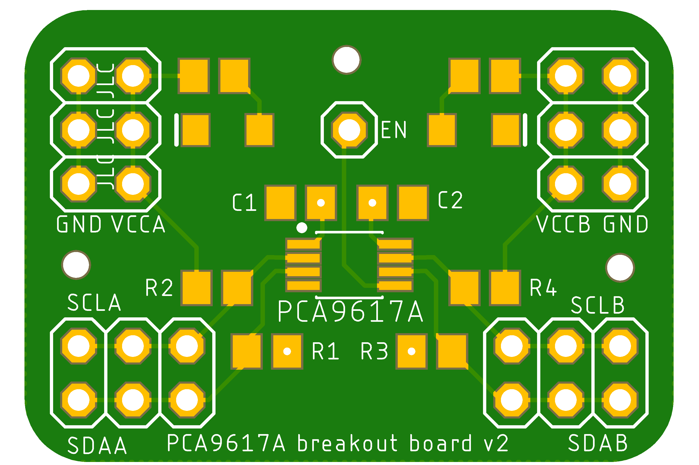
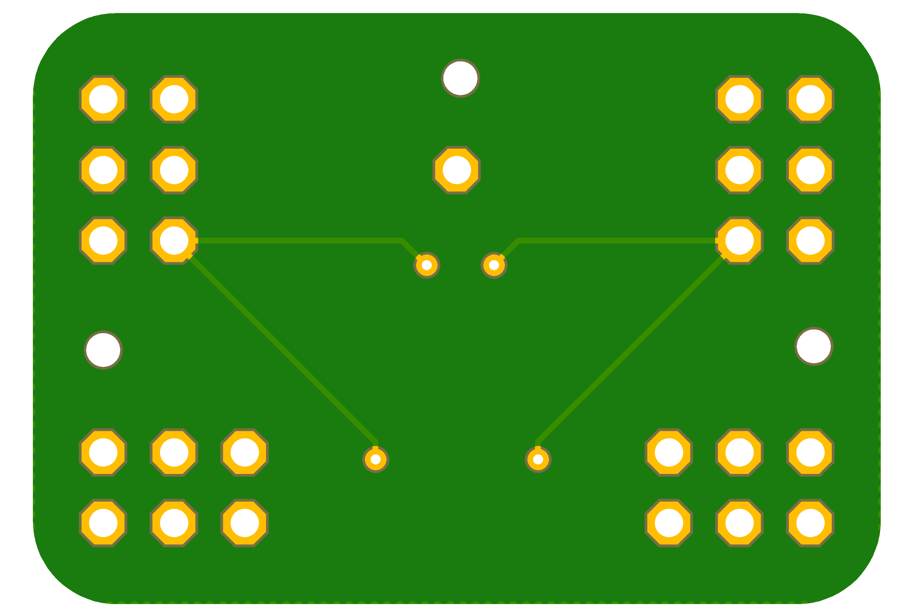

# PCA9617A i2c buffer

a breakout board for the PCA9617A. The PCA supports voltage shifting, if desired; to easily hook up multiple devices all power and i2c lines are exposed multiple times

[Gerber files](./pca9617a-v2.zip)

### top

### bottom 

### schematic

### BOM

- 2x 100nF 0805 capacitors
- 4x 1k4 0805 resistors
- 1x 9617A i2c buffer
- 4x 2x3 pinheads

optional, for power leds:

- 2x 3k3 0805 resistors
- 2x 1206 LED 
