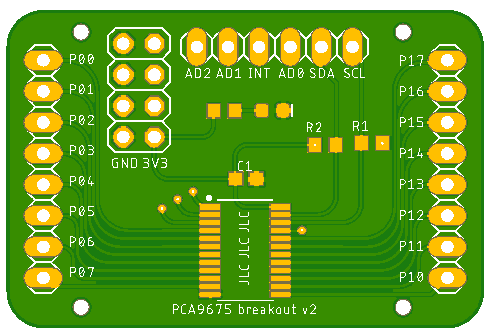
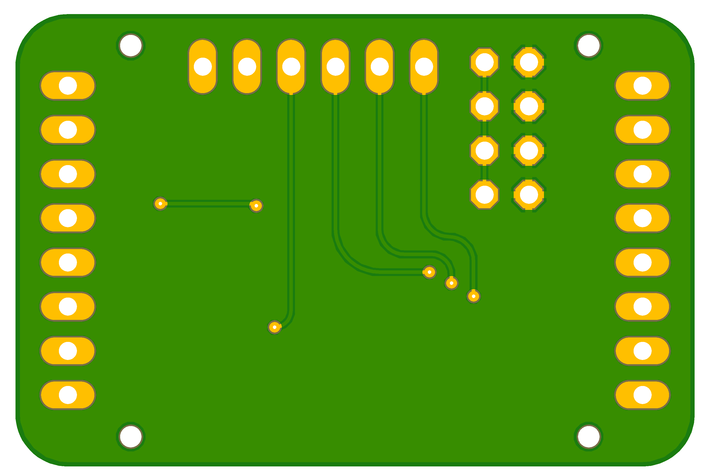

# PCA9675 i/o expander

a breakout board for the PCA9675. 

[Gerber files](./pca9675-v2.zip)

### top

### bottom 

### schematic

### BOM

- 1x 100nF 0805 capacitors
- 1x 9675 i/o expander
- 1x 2x4 pinhead
- 2x 1x8 pinhead
- 1x 1x6 pinhead

optional, for power leds:
- 1x 3k3 0805 resistors
- 1x 1206 LED 

optional, for direct i2c connections:
- 2x 1k4 0805 resistor
