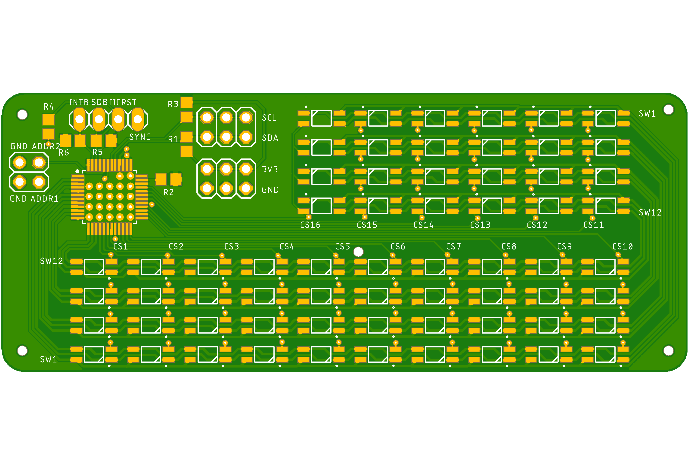
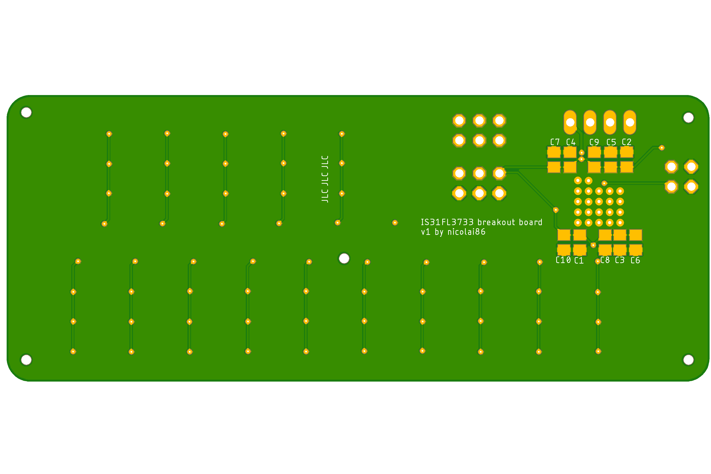

# IS31FL3733 led driver

a breakout board for the IS31FL3733. 

[Gerber files](./IS31FL3733-v1.zip)

### top

### bottom 

### schematic

### BOM

- 47nF 0805 Capacitor, 5x
- 100nF 0805 Capacitor, 4x
- 22uF 0805 Capacitor, 1x
- IS31FL3733 QFP-48, 1x
- 100k 0805 Resistor, 3x
- 20k 0805 Resistor, 1x
- 3528-RGB-LED, 64x

Optional, pinheaders for connectivity to other breakout boards