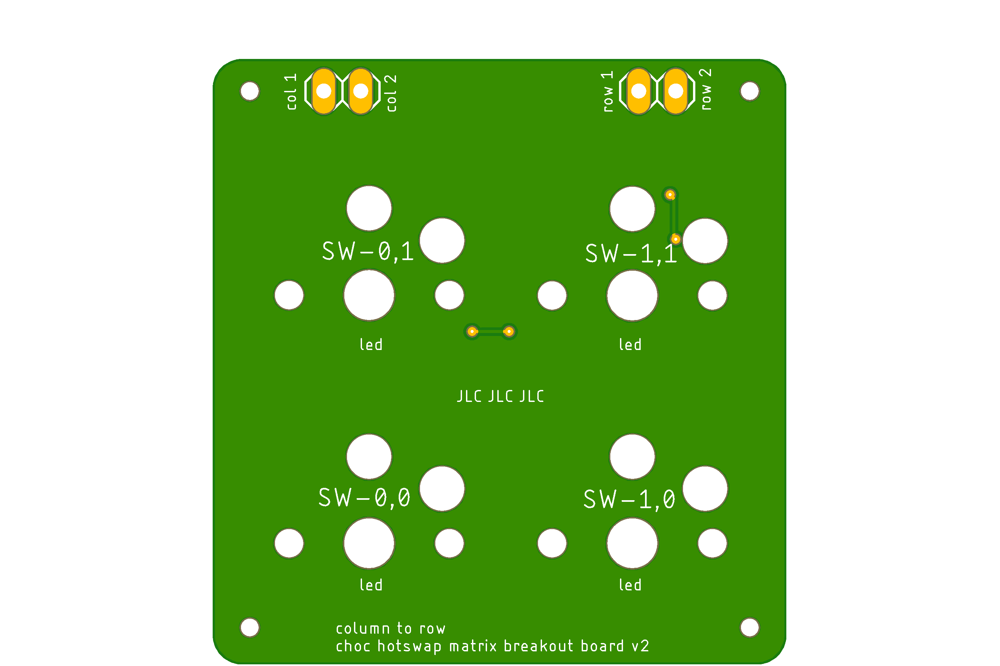
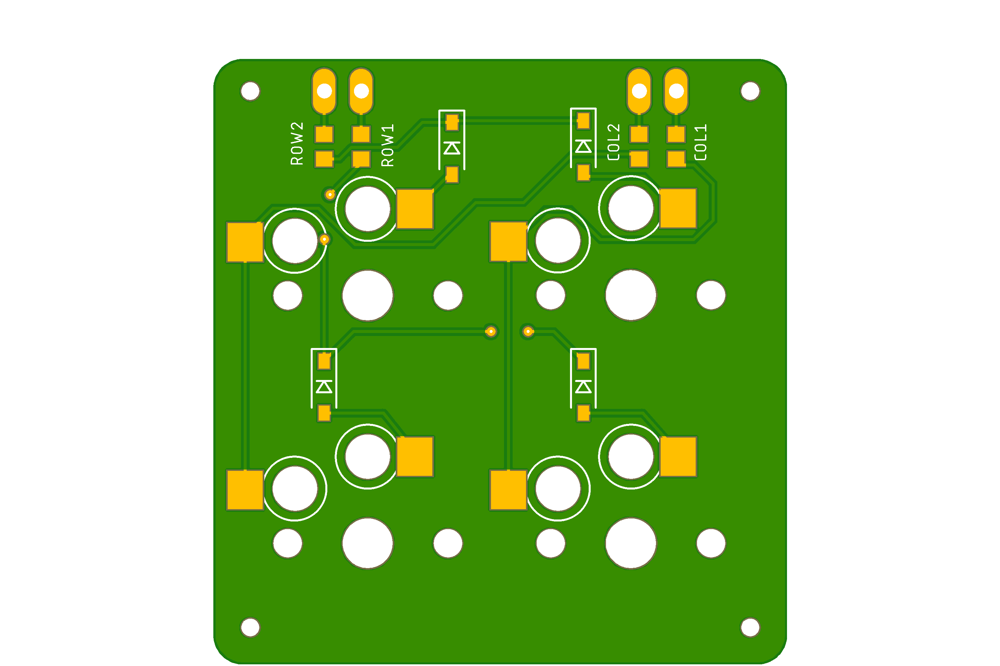

# hotswappable kailh choc breakout board

a breakout board for kailh choc switches.

layed out in a 2x2 matrix, with 17.05mm x 18.05mm spacing to fit regular kailh keycaps and switches.

The keyboard matrix is setup for column to row scanning

### top

### bottom 

### schematic

### BOM

- 4x 470 O 0603 resistor
- 2x 1x2 2.54mm pinheader
- 4x 1N4148 0805 diodes
- 4x kailh choc hotswap socket
